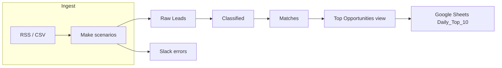

# Marketplace Opportunity Matcher & Prioritizer

> **Elevator line:** A production-style daily workflow that collects marketplace listings (RSS / API / CSV—**no scraping**), stores and cleans data in **Airtable**, classifies **supply vs. demand**, **scores** matches, and ships a prioritized **Top 10** to **Google Sheets** with **Make** (Zapier optional for CSV/email fallback).

## At a glance

| | |
|--|--|
| **Positioning** | End-to-end automation & operations — reliable schedules, error handling, stakeholder-ready output |
| **Core stack** | **Airtable** · **Make** · **Google Sheets** · **Zapier** (fallback) · **Google APIs** (geocode / distance) · **Slack** |
| **Throughput** | **500+** new leads/day (design target); rule-based matching at scale |
| **What ships** | Classified records, scored **Matches**, filtered **Top Opportunities** view, **Daily_Top_10** sheet + optional email/Slack |
| **Differentiator** | No brittle scraping — **RSS**, **APIs**, and **manual CSV** paths; explicit **Pending** queue for ambiguous listings |

**Impact & delivery** *(edit numbers to match your engagement before portfolio use)*

| Metric | Reference |
|--------|-------------|
| Test volume | **2,500+** labeled test records |
| Accuracy | **~98%** match accuracy in test runs |
| Uptime (pilot) | **0** unplanned downtime over **14** days |
| Cost (indicative) | **~$15/mo** Make + Airtable Pro–class tiers + API usage |
| Timeline | **~1 week** build + **~1 week** hardening |

**Contact & links** *(replace placeholders)*

| | |
|--|--|
| **Author** | *Your Name* |
| **LinkedIn / portfolio** | *https://* |
| **Airtable template** | [`airtable/AIRTABLE_TEMPLATE.md`](airtable/AIRTABLE_TEMPLATE.md) |
| **Screenshots / demos** | [`assets/screenshots/`](assets/screenshots/) |

---

## What this repo contains

A reliable daily workflow to collect listings from online marketplaces (e.g., Craigslist, Facebook Marketplace where RSS/API exists), store and clean data in **Airtable**, apply **rule-based matching** (supply vs. demand), **score** opportunities, and output a prioritized **Top 10** list in **Google Sheets**. Automations run in **Make** (with Zapier as a CSV fallback), using APIs, RSS, and manual CSV upload. Designed for **500+ records/day** with high classification accuracy.

---

## 1-2-3 overview

1. **Ingest** — Schedule (e.g., 6 AM): pull RSS feeds and optional CSV uploads → create **Raw Leads** in Airtable; geocode locations (Google Maps API). Errors retry and log to Slack.
2. **Clean & classify** — Regex and mapping modules normalize title, price, location, category; a **Router** labels each row **Supply**, **Demand**, or **Pending** (manual queue).
3. **Match, score, publish** — Iterator matches supply/demand by location, category, price fit, and keyword overlap; **Airtable formulas** compute scores; a morning scenario writes the **Daily Top 10** to Google Sheets and notifies the team.

---

## Repository contents

| Path | Purpose |
|------|---------|
| [`make/DAILY_PULL.md`](make/DAILY_PULL.md) | **Ingest:** RSS + CSV → Raw Leads, geocode, retries, Slack |
| [`make/CLEAN_CLASSIFY.md`](make/CLEAN_CLASSIFY.md) | **Clean & classify:** regex, price, category map, Router → Classified |
| [`make/MATCH_AND_SCORE.md`](make/MATCH_AND_SCORE.md) | **Match & score:** Distance Matrix, price/keyword rules → Matches |
| [`make/scenarios/`](make/scenarios/) | Make scenario flow templates (JSON) — rebuild in Make, then export real blueprints here |
| [`airtable/`](airtable/) | [`SETUP.md`](airtable/SETUP.md) (build order), [`schema.md`](airtable/schema.md) (reference), [`formulas.md`](airtable/formulas.md), [`AIRTABLE_TEMPLATE.md`](airtable/AIRTABLE_TEMPLATE.md) (share link when ready) |
| [`sample-data/`](sample-data/) | Example CSVs for Raw Leads and manual upload testing |
| [`scoring/`](scoring/) | Scoring weights, Airtable formula notes, and a CSV for Google Sheets |
| [`assets/screenshots/`](assets/screenshots/) | Place screenshots here for documentation (repo ships with a placeholder README) |

---

## Architecture (high level)



---

## Database: Airtable base “Opportunity Hub”

### Raw Leads

| Field | Type | Notes |
|-------|------|--------|
| Source | Single line text | Marketplace name |
| Title | Single line text | |
| Description | Long text | |
| Price | Number or text (clean in Make) | |
| Location | Single line text | Geocoded downstream |
| Category | Single line text | |
| Raw_Data | Long text | JSON string of original payload |
| Timestamp | Date/time | |
| Status | Single select | New / Processed |

### Classified (linked to Raw Leads)

| Field | Type | Notes |
|-------|------|--------|
| Raw Lead | Link | |
| Supply/Demand | Single select | Supply / Demand / Pending |
| Keywords | Long text or multi-line | Auto-extracted |
| Standardized_Price | Number | |
| Clean_Location | Single line text | Normalized address or city |

### Matches (self-linked supply/demand)

| Field | Type | Notes |
|-------|------|--------|
| Matched_Supply_ID | Link to Classified | Supply side |
| Matched_Demand_ID | Link to Classified | Demand side |
| Match_Score | Number | 0–100 |
| Notes | Long text | Optional |

### Top Opportunities (view)

- Filter: **Match_Score** > 80 (adjust as needed), **Timestamp** within last 24 hours (or use formula fields for freshness).
- Sort: Score descending.

Full field-level detail and formula placeholders: [`airtable/schema.md`](airtable/schema.md).

---

## Make scenarios (summary)

Build **Daily Pull** using [`make/DAILY_PULL.md`](make/DAILY_PULL.md) (field mapping, geocode HTTP, CSV webhook, Slack, 3× retry). Use [`sample-data/manual-upload-template.csv`](sample-data/manual-upload-template.csv) for the CSV path.

**Clean & Classify:** [`make/CLEAN_CLASSIFY.md`](make/CLEAN_CLASSIFY.md) (~95% auto-classify target). **Match & Score:** [`make/MATCH_AND_SCORE.md`](make/MATCH_AND_SCORE.md) (50 mi, ±20% price fit, ≥3 keyword overlaps; **>70** / **>80** thresholds).

| Scenario | Trigger | Role |
|----------|---------|------|
| **Daily Pull** | Schedule (e.g., 6 AM) | RSS → parse → Raw Leads; optional CSV path; geocode; error handler → Slack |
| **Clean & Classify** | Webhook or Airtable “when record matches” / scheduled poll | Regex, category mapping, price normalization, Supply/Demand Router |
| **Match & Score** | Iterator over new Classified rows | Location/category/price/keyword rules; create/update Matches; set component scores for Airtable formula |
| **Daily Top 10** | Schedule (e.g., 7 AM) | Query view → dedupe pairs → Google Sheet `Daily_Top_10` → optional email |

Import JSON from [`make/scenarios/`](make/scenarios/). See [`make/IMPORT_INSTRUCTIONS.md`](make/IMPORT_INSTRUCTIONS.md) for export/import notes.

---

## Classification rules (supply vs demand)

| Keyword signals | Classification | Example |
|-----------------|----------------|---------|
| “selling”, “for sale”, price > 0 | **Supply** | “Selling bike $200” |
| “wanted”, “ISO”, “buying”, “need” | **Demand** | “Wanted: laptop under $500” |
| Neutral / unclear | **Pending** | “Free couch?” (manual review) |

Target: ~**95%** auto-classify to Supply or Demand; remainder **Pending** (see [`make/CLEAN_CLASSIFY.md`](make/CLEAN_CLASSIFY.md)).

---

## Matching & scoring

- **Location:** Same city or within ~50 mi (e.g., Google Distance Matrix API).
- **Category:** Exact or allowed parent/child (e.g., Electronics → Phones).
- **Price:** Demand max ≥ supply price within a tolerance (e.g., ±20%).
- **Keywords:** Minimum overlaps; fuzzy match via Make Text Parser or similar.

**Composite score (conceptual):**

```
Score = (Location_Match × 30) + (Category_Match × 25) + (Price_Fit × 20)
        + (Keyword_Overlap × 15) + (Freshness_Bonus × 10)
```

- **Freshness:** Full 10 points if &lt; 24h; decay linearly afterward (implement via Airtable formula or helper fields).

Matches above **~70** are strong candidates; **Top Opportunities** view typically uses **> 80** for the daily shortlist.

Details and example Airtable patterns: [`scoring/README.md`](scoring/README.md) and [`scoring/scoring-components.csv`](scoring/scoring-components.csv).

---

## Daily output (Google Sheets)

Columns (example): **Opportunity_Pair**, **Score**, **Links** (supply/demand URLs or Airtable record links), **Action_Next** (e.g., email template or Slack channel). Share the sheet and optionally email a PDF/ link to the team; embed the Airtable dashboard where useful.

---

## Tools & cost (reference)

- **Airtable** — database and views  
- **Make** — primary automation (~80% of flows)  
- **Zapier** — optional CSV/email fallback  
- **Google Sheets** — Daily Top 10  
- **Google APIs** — Geocoding, Distance Matrix (respect quotas and billing)  

Indicative ops cost (your mileage may vary): on the order of tens of dollars per month for typical Pro tiers plus API usage.

---

## Testing & reliability

- Run batch tests (e.g., thousands of synthetic or anonymized rows) and compare classifications/matches to a labeled set.
- Use Make error handlers, retries (e.g., 3×), and Slack (or email) for failure logs.
- Monitor API quotas (Google, Airtable rate limits).

---

## Setup checklist

1. **Airtable:** Follow [`airtable/SETUP.md`](airtable/SETUP.md) to create **Opportunity Hub** (tables, links, scoring fields, **Top Opportunities** view). Add formulas from [`airtable/formulas.md`](airtable/formulas.md). Publish the template URL in [`airtable/AIRTABLE_TEMPLATE.md`](airtable/AIRTABLE_TEMPLATE.md).
2. **Ingest (Make):** Implement **Daily Pull** per [`make/DAILY_PULL.md`](make/DAILY_PULL.md) — schedule, RSS iterator, geocoding, Airtable **Raw Leads** create, **3×** retry, **Slack** on failure; optional CSV/webhook path with [`sample-data/manual-upload-template.csv`](sample-data/manual-upload-template.csv). Export blueprint into [`make/scenarios/`](make/scenarios/).
3. **Clean & Classify (Make):** Implement per [`make/CLEAN_CLASSIFY.md`](make/CLEAN_CLASSIFY.md); export [`clean-classify.json`](make/scenarios/clean-classify.json).
4. **Match & Score (Make):** Implement per [`make/MATCH_AND_SCORE.md`](make/MATCH_AND_SCORE.md); export [`match-and-score.json`](make/scenarios/match-and-score.json).
5. Duplicate the base (from your template link) or continue in the same base; plug in API keys (Make, Google, Slack).
6. Import remaining Make scenarios (e.g. Daily Top 10); reconnect modules to your Airtable base and Google Sheet.
7. Load [`sample-data/sample-raw-leads.csv`](sample-data/sample-raw-leads.csv) to validate paths.
8. Add real RSS URLs and run a dry-run day before production.

---

## License

Use and adapt for your project. Add a `LICENSE` file if you need a specific open-source terms.

---

## Contributing

Replace template links, add your exported Make blueprints after testing, and drop screenshots into `assets/screenshots/` for a polished README on GitHub.
